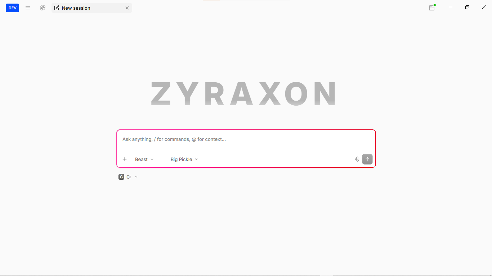

<p align="center">
  <picture>
    <source srcset="packages/console/app/src/asset/logo-ornate-dark.svg" media="(prefers-color-scheme: dark)">
    <source srcset="packages/console/app/src/asset/logo-ornate-light.svg" media="(prefers-color-scheme: light)">
    
  </picture>
</p>

<h1 align="center">ZYRAXON</h1>

<p align="center">
  <strong>All in one. Anything. Nothing is impossible.</strong>
</p>

<p align="center">
  <a href="https://zyraxonai.lovable.app/"></a>
  <a href="https://github.com/onelpawarai/ZYRAXON-AI/releases"></a>
  <a href="https://github.com/onelpawarai/ZYRAXON-AI/stargazers"></a>
  <a href="https://github.com/onelpawarai/ZYRAXON-AI/issues"></a>
  <a href="https://github.com/onelpawarai/ZYRAXON-AI/blob/main/LICENSE"></a>
  <a href="https://github.com/onelpawarai/ZYRAXON-AI/releases"></a>
  <a href="https://github.com/onelpawarai/ZYRAXON-AI/graphs/contributors"></a>
  <a href="https://github.com/onelpawarai/ZYRAXON-AI/commits/main"></a>
</p>

<p align="center">
  <a href="https://zyraxonai.lovable.app/"><strong>🌐 Visit our Website</strong></a> •
  <a href="https://github.com/onelpawarai/ZYRAXON-AI/releases"><strong>⬇️ Download</strong></a> •
  <a href="https://youtube.com/@zyraxon-aix"><strong>📺 YouTube</strong></a>
</p>

<p align="center">
  <strong>Desktop AI agent that actually does things. Not a chatbot — an action-bot.</strong><br>
  Reads your files. Writes your code. Runs your commands. Builds your projects. Deploys your apps.<br>
  It has <strong>Beast Mode</strong>, <strong>Persistent Memory</strong>, and it <strong>evolves itself</strong>.
</p>

<p align="center">
  
</p>

---

## What is ZYRAXON?

ZYRAXON is an open-source desktop AI agent built on Electron + SolidJS + Bun. Unlike ChatGPT or other chatbots that just *talk*, ZYRAXON **takes action** — it has full access to your filesystem, terminal, browser, and more.

It's built on top of [OpenCode](https://github.com/anomalyco/opencode) and extended with features that don't exist anywhere else:

- **Beast Mode** — Maximum power agent with 3-level deep subagent army
- **Persistent Memory** — Remembers everything across sessions (SQLite-backed)
- **Self-Evolution** — Installs its own MCP servers and tools at runtime
- **Voice Input** — Click the mic, speak naturally, it transcribes via Whisper
- **Auto-Approve** — All permissions auto-approved. No interruptions, just results.
- **20+ AI Models** — OpenAI, Anthropic, Gemini, DeepSeek, Meta, and more

### See it in action

<table>
  <tr>
    <td align="center"><strong>Output 1</strong></td>
    <td align="center"><strong>Output 2</strong></td>
  </tr>
  <tr>
    <td></td>
    <td></td>
  </tr>
  <tr>
    <td align="center"><strong>Output 3</strong></td>
    <td align="center"><strong>Output 4</strong></td>
  </tr>
  <tr>
    <td></td>
    <td></td>
  </tr>
</table>

---

## Why ZYRAXON?

| Feature | ChatGPT / Claude | Cursor | ZYRAXON |
|---------|:---:|:---:|:---:|
| Desktop app (Electron) | - | Yes | Yes |
| Full filesystem access | - | Yes | Yes |
| Terminal/command execution | - | Yes | Yes |
| Web browsing | - | - | Yes |
| Beast Mode (3-level subagents) | - | - | Yes |
| Persistent memory across sessions | - | - | Yes |
| Self-evolving (installs its own tools) | - | - | Yes |
| Voice input (Whisper) | - | - | Yes |
| Auto-approve all permissions | - | - | Yes |
| 20+ LLM models | 1 | Limited | Yes |
| Theme engine (30+ themes) | - | - | Yes |
| 100% free & open source | No | No | Yes |
| Runs locally (no cloud) | No | No | Yes |

---

## Agent Modes

ZYRAXON has 3 built-in agent modes. Switch with the `Tab` key:

### Build Mode (Default)
The reliable workhorse. Full file system access + persistent memory.
> Read/Write files, Run commands, Browse web, Generate images, Remember everything

### Plan Mode
Strategic, read-only analysis. Plans the perfect approach before any action.
> Read-only analysis, Plan creation, Strategic thinking

### Beast Mode
**Maximum power. Zero limits. Never stops.**
> Everything Build has + **Mission Control** (3-level subagents) + **Self-Evolution** (install new tools) + **Subagent Army** (parallel execution) + **Autonomous Completion** (never gives up)

---

## Quick Start

### 🌐 Visit Our Website

**[zyraxonai.lovable.app](https://zyraxonai.lovable.app/)** — Download, learn more, and explore features.

### Download (Recommended)

Download the latest release from our **[website](https://zyraxonai.lovable.app/)** or the [**Releases page**](https://github.com/onelpawarai/ZYRAXON-AI/releases):

| Platform | File | Architecture |
|----------|------|:------------:|
| Windows | `ZYRAXON Dev-win-installer.exe` | x64 |
| macOS | `zyraxon-desktop-mac-arm64.dmg` | Apple Silicon |
| macOS | `zyraxon-desktop-mac-x64.dmg` | Intel |
| Linux | `zyraxon-desktop-linux-x64.AppImage` | x64 |

### Install from source

```bash
git clone https://github.com/onelpawarai/ZYRAXON-AI.git
cd ZYRAXON-AI
bun install --ignore-scripts
cd packages/desktop
bun run build
bun run package:win   # or package:mac / package:linux
```

> Requires [Bun](https://bun.sh) 1.3.14+ and Node.js 22+

---

## Key Features

### Beast Mode with Subagent Army
When you switch to Beast Mode, ZYRAXON unlocks **5 unique powers**:

1. **Mission Control** — Breaks complex tasks into parallel subtasks, each handled by a subagent
2. **Self-Evolution** — Installs new MCP servers, tools, and extensions at runtime via the `self_evolve` tool
3. **Persistent Memory** — Store, recall, and search memories across sessions via the `memory` tool
4. **Subagent Army** — 3-level deep nested subagents (subagents that spawn subagents)
5. **Autonomous Completion** — Never stops until the task is 100% complete

### Voice Input
Click the mic button, speak naturally in any language. ZYRAXON uses OpenAI Whisper to transcribe your voice to text. Set `OPENAI_API_KEY` to enable.

### 30+ Built-in Themes
Switch between themes instantly: Dracula, Catppuccin, Gruvbox, Nord, Tokyo Night, Rose Pine, One Dark, Material, and many more.

### Multi-Model Support
Use any AI model from any provider:
- **OpenAI** — GPT-4o, GPT-4.1, o3
- **Anthropic** — Claude Opus, Sonnet, Haiku
- **Google** — Gemini 2.5 Pro, Flash
- **DeepSeek** — V4 Pro, Flash
- **Meta** — Llama 4
- **Free models** — 20+ free models via OpenCode (no API key needed)

---

## Project Structure

```
ZYRAXON-AI/
├── packages/
│   ├── opencode/          # Core AI agent engine
│   │   └── src/
│   │       ├── agent/     # Agent modes (Build, Plan, Beast)
│   │       ├── tool/      # Tools (memory, self_evolve, task, shell, etc.)
│   │       └── session/   # Session management, LLM streaming
│   ├── desktop/           # Electron desktop app
│   ├── app/               # SolidJS UI
│   ├── ui/                # Shared UI components
│   ├── session-ui/        # Chat/session UI
│   ├── core/              # Core utilities, database
│   ├── tui/               # Terminal UI, themes
│   └── sdk/               # JavaScript SDK
├── README.md
└── package.json
```

---

## Tech Stack

| Layer | Technology |
|-------|-----------|
| Runtime | Bun |
| Desktop | Electron 42 + electron-vite |
| UI | SolidJS + TailwindCSS |
| Database | SQLite (drizzle-orm) |
| Build | electron-builder |
| Language | TypeScript |
| LLM Runtime | AI SDK (Vercel) |

---

## Contributing

We love contributions! See our [Contributing Guide](CONTRIBUTING.md) for details.

### Quick Start

1. **Fork** the repository
2. **Clone** your fork: `git clone https://github.com/YOUR_USERNAME/ZYRAXON-AI.git`
3. **Install**: `bun install`
4. **Build**: `cd packages/opencode && bun run build`
5. **Create branch**: `git checkout -b feat/my-feature`
6. **Commit**: `git commit -m "feat: add my feature"`
7. **Push**: `git push origin feat/my-feature`
8. **Open PR**

### Development

```bash
# TUI mode
bun run dev

# Desktop app
bun run dev:desktop

# Build core
cd packages/opencode && bun run build

# Build desktop
cd packages/desktop && bun run build

# Typecheck
bun typecheck
```

---

## Roadmap

- [x] Beast Mode with 5 powers
- [x] Screen Vision tool
- [x] API Tester tool
- [x] Code Analyzer tool
- [x] System Info tool
- [x] Unlimited Memory system
- [x] Auto-update system
- [x] Voice input (Whisper)
- [ ] Mobile companion app
- [ ] Plugin marketplace
- [ ] Team collaboration features
- [ ] Cloud sync (optional)
- [ ] More AI model integrations
- [ ] Browser extension

See [open issues](https://github.com/onelpawarai/ZYRAXON-AI/issues) for planned features and known issues.

---

## Support

If you find ZYRAXON-AI useful, please consider:

- ⭐ **Starring** the repository
- 🐛 **Reporting** bugs via [Issues](https://github.com/onelpawarai/ZYRAXON-AI/issues)
- 💡 **Suggesting** new features
- 🔀 **Contributing** code
- 📢 **Sharing** with friends and colleagues

---

## License

[MIT](./LICENSE) - Free to use, modify, and distribute.

---

<p align="center">
  <strong>Built with obsession. Powered by AI.</strong><br><br>
  <a href="https://github.com/onelpawarai/ZYRAXON-AI">
    
  </a>
</p>
